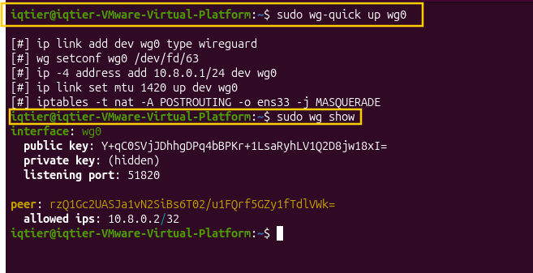
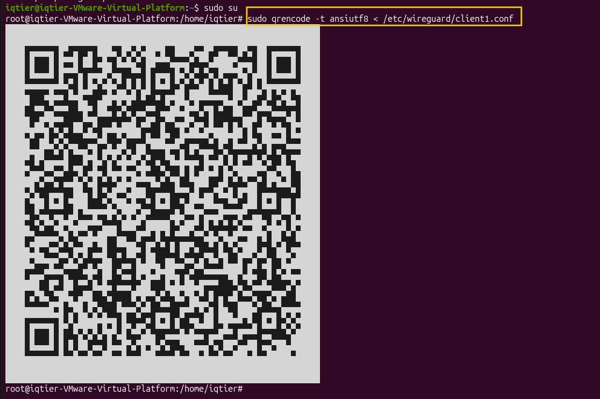
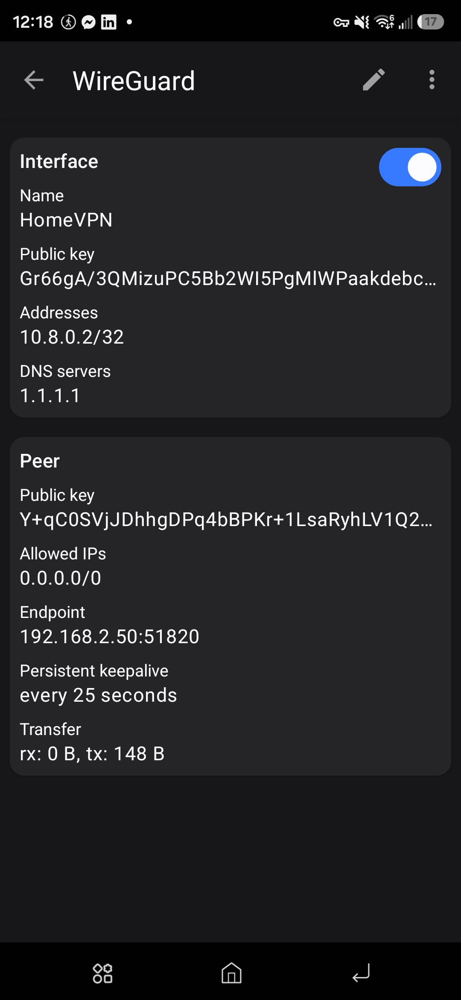
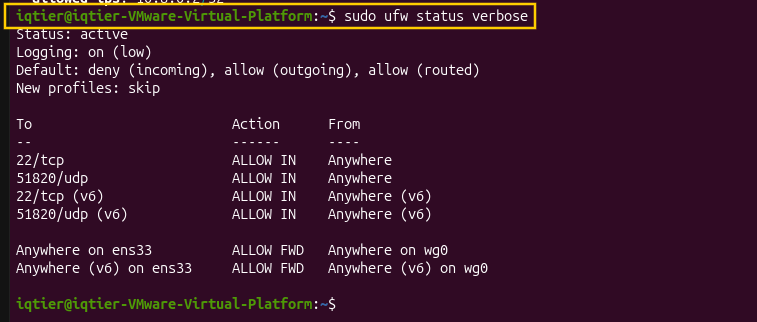

# VPN Management Platform

## Project Overview

This project is a full stack VPN management system. It lets an admin create and manage VPN client access through a web dashboard, instead of doing everything manually on the server.

The system has three parts. A VPN server that handles the actual encrypted connections. A backend API that manages data and controls the VPN server. A frontend dashboard where an admin can add or remove VPN clients with a few clicks.

## Objective

The goal is to build a working, secure, and well documented VPN management product. This project shows skills in Linux system administration, network security, backend development, database management, and frontend development. It is meant to be a centerpiece project for a cybersecurity and computer science portfolio.

## Technology Stack

| Technology | Purpose |
|---|---|
| Ubuntu Linux (VM) | Hosts the VPN server |
| WireGuard | The VPN protocol used to create secure, encrypted tunnels between the server and clients |
| iptables | Handles NAT so VPN client traffic can reach the internet through the server |
| UFW | Firewall on the server, controls what traffic is allowed in and out |
| PostgreSQL | Stores data about clients, their keys, and their allocated IP addresses |
| Entity Framework Core (EF Core) | Lets the backend talk to PostgreSQL using C# code instead of raw SQL |
| ASP.NET Core (C#) | The backend API. It manages the database and runs commands on the VPN server |
| Next.js | The frontend dashboard the admin uses to manage clients |

## Project Plan

The project is built in phases:

1. Set up the Linux VM and base network configuration
2. Install and configure WireGuard, connect a real client, and confirm internet access through the tunnel
3. Set up PostgreSQL and confirm the backend can read and write to it using EF Core
4. Build the ASP.NET Core API. This API will run WireGuard commands on the server automatically
5. Build the Next.js dashboard so an admin can manage everything from a browser

## Progress

### Completed
- Phase 1: Linux VM and network setup
- Phase 2: WireGuard server and client setup, routing fixed, first successful connection
- Phase 3: PostgreSQL and EF Core setup and tested

### Remaining
- Phase 4: Build the ASP.NET Core API
- Phase 5: Build the Next.js dashboard
- Final testing and polish

---

## How I Set Up WireGuard, Step by Step

This section follows the actual order I did things in, from creating keys to a working connection on my phone.

### Step 1: Install WireGuard and generate keys

I installed WireGuard on the Ubuntu server. Then I generated a key pair for the server and a key pair for the client. Each key pair has a private key and a public key.

```bash
cd /etc/wireguard
umask 077
wg genkey | tee server_private.key | wg pubkey > server_public.key
wg genkey | tee client1_private.key | wg pubkey > client1_public.key
```

The `umask 077` command makes sure the key files can only be read by the owner. This keeps the private keys safe from other users on the system.

### Step 2: Create the server config file

This file tells WireGuard the server's own address inside the VPN, which port to listen on, and which client is allowed to connect.

```bash
sudo nano /etc/wireguard/wg0.conf
```

```
[Interface]
PrivateKey = <server_private_key>
Address = 10.8.0.1/24
ListenPort = 51820

[Peer]
PublicKey = <client_public_key>
AllowedIPs = 10.8.0.2/32
```

### Step 3: Set up NAT so tunnel traffic can reach the internet

Inside the same `wg0.conf` file, under the `[Interface]` section, I added two lines. These run automatically every time the tunnel starts and stops.

```
PostUp = iptables -t nat -A POSTROUTING -o ens33 -j MASQUERADE
PostDown = iptables -t nat -D POSTROUTING -o ens33 -j MASQUERADE
```

This rule lets traffic coming from the VPN clients go out to the internet using the server's own network connection.

### Step 4: Start the WireGuard interface

```bash
sudo wg-quick up wg0
```

To check that it was running, I used:

```bash
sudo wg show
```

**[SCREENSHOT 1: `sudo wg show` output showing the interface up, with the server key, port, and the connected peer]**


### Step 5: Create the client config file

This file is what the phone actually needs to connect. It uses the client's own private key, and the server's public key and address, so the two sides can recognize each other.

```bash
cd /etc/wireguard
SERVER_PUB=$(sudo cat server_public.key)
CLIENT_PRIV=$(sudo cat client1_private.key)

sudo tee client1.conf > /dev/null <<EOF
[Interface]
PrivateKey = $CLIENT_PRIV
Address = 10.8.0.2/32
DNS = 1.1.1.1

[Peer]
PublicKey = $SERVER_PUB
Endpoint = 192.168.2.50:51820
AllowedIPs = 0.0.0.0/0
PersistentKeepalive = 25
EOF

sudo chmod 600 client1.conf
```

`AllowedIPs = 0.0.0.0/0` tells the phone to send all of its internet traffic through the tunnel, not just some of it.

### Step 6: Transfer the client config to my phone

Instead of sending the file over email or a USB cable, I turned it into a QR code and scanned it directly with the WireGuard app. This way the private key never leaves the server as a saved file anywhere else, it only appears on screen for the scan.

I installed a tool called `qrencode` to generate the QR code.

```bash
sudo apt install -y qrencode
```

Then I showed the client config as a QR code right in the terminal.

```bash
sudo qrencode -t ansiutf8 < /etc/wireguard/client1.conf
```

On the phone, I opened the WireGuard app, chose "Scan from QR code", and scanned the code shown in the terminal. The tunnel was added right away.

After scanning, I deleted the temporary config file from the server using `shred`, which overwrites the file before deleting it. This is safer than a normal delete since the file briefly held a private key.

```bash
sudo shred -u /etc/wireguard/client1.conf
```

**[SCREENSHOT 2: The QR code shown in the terminal]**


**[SCREENSHOT 3: The WireGuard app on the phone showing the tunnel added]**


### Step 7: First connection attempt, and the routing problem

I turned the tunnel on from the phone. The handshake worked right away, meaning the phone and server could see each other and trust each other's keys. But when I tried to open a webpage on the phone, nothing loaded. No internet was reaching the phone through the tunnel.

The problem was the server's firewall. By default, UFW blocks traffic that is routed through the server to somewhere else. This is different from normal incoming or outgoing traffic on the server itself. Since the phone's internet traffic needs to go from the phone, through the server, out to the real internet, this counts as routed traffic. UFW was blocking it even though the tunnel itself was working fine.

### Step 8: Fix the routing problem

I fixed this in two parts.

First, I added a rule that allows traffic to move from the VPN interface out to the internet facing interface.

```bash
sudo ufw route allow in on wg0 out on ens33
```

Second, I made sure IP forwarding was turned on, in two separate places. UFW keeps its own copy of this setting, separate from the main system setting, so both had to be correct or the fix would not hold.

```bash
sudo nano /etc/sysctl.conf
```
Inside this file, I made sure this line was present and not commented out:
```
net.ipv4.ip_forward=1
```

```bash
sudo nano /etc/ufw/sysctl.conf
```
Inside this file, I made sure this line was present:
```
net/ipv4/ip_forward=1
```

Then I reloaded UFW.

```bash
sudo ufw reload
```

**[SCREENSHOT 4: `sudo ufw status verbose` output showing the route rule and the firewall rules]**


### Step 9: Confirm internet works through the tunnel

After the fix, I went back to the phone with the tunnel still on and opened a webpage. It loaded normally this time.

To be sure the fix was permanent and not a lucky moment, I restarted the whole VM and tested again without running any manual commands first. Internet still worked right away, which proved the settings were saved correctly and not just applied temporarily.


---

## How I Set Up the Database

I installed PostgreSQL on the same Ubuntu server.

```bash
sudo apt install -y postgresql postgresql-contrib
```

Instead of using the default `postgres` superuser for the app, I created a separate database and a separate user just for this project. This way, if the app's database password ever leaks, it only has access to this one database, not the whole server.

```bash
sudo -u postgres psql
```

Inside the PostgreSQL prompt:

```sql
CREATE DATABASE vpn_manager;
CREATE USER vpn_api WITH ENCRYPTED PASSWORD 'change_this_password';
GRANT ALL PRIVILEGES ON DATABASE vpn_manager TO vpn_api;
```

Then I tested that the new user could actually connect:

```bash
psql -h localhost -U vpn_api -d vpn_manager
```

To confirm the backend could talk to this database, I built a small test program using EF Core, the tool that lets C# code read and write to the database without writing raw SQL. I installed the SDK and the PostgreSQL package for EF Core.

```bash
sudo apt install -y dotnet-sdk-8.0
dotnet new console
dotnet add package Npgsql.EntityFrameworkCore.PostgreSQL --version 8.0.10
```

The test program created a table, added a row, and read it back. I then checked the database directly to make sure the data was really there.

```bash
sudo -u postgres psql -d vpn_manager -c "SELECT * FROM \"Peers\";"
```

**[SCREENSHOT 6: The test program output in the terminal, showing the row it inserted]**
``

**[SCREENSHOT 7: The matching `psql` query result showing the same row]**
``

---

## What Is Left

The database and VPN server are both working and tested. The next step is to build the ASP.NET Core API. This API will run WireGuard commands automatically instead of me typing them by hand. After that, I will build the Next.js dashboard so all of this can be managed from a browser.
